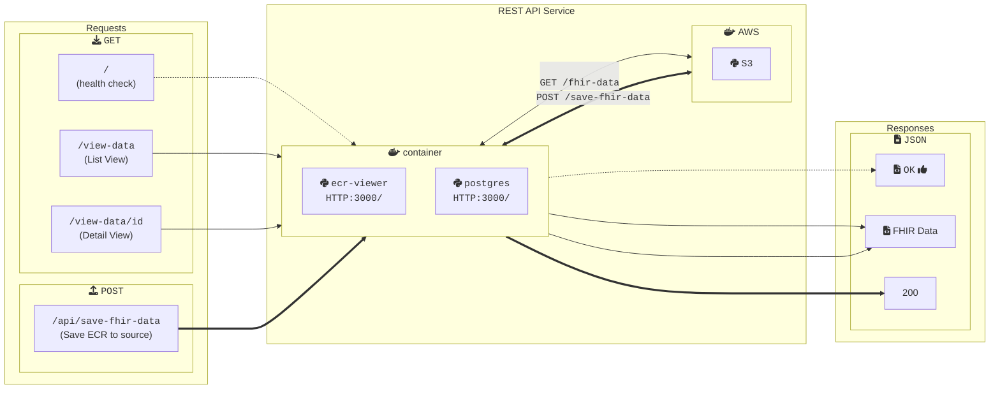
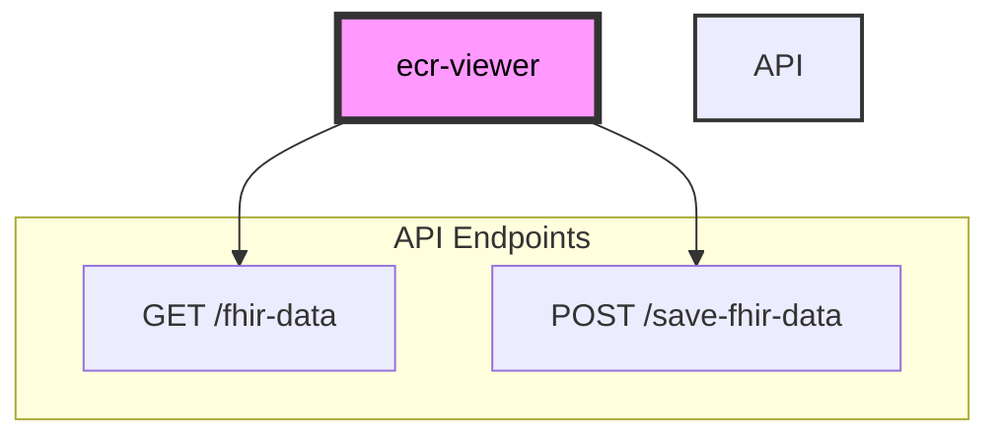

# Getting Started with DIBBs eCR Viewer

## Introduction

The DIBBs eCR Viewer service offers a REST API for processing eCR FHIR messages into an HTML page that displays key information in a readable format and makes specific data fields easy to find.

## Running eCR Viewer

You can run the eCR Viewer using Docker, any other OCI container runtime (e.g., Podman), or directly from the source code.

### Running with Docker (Recommended)

To run the eCR Viewer with Docker, follow these steps.

1. Confirm that you have Docker installed by running `docker -v`. If you don't see a response similar to what's shown below, follow [these instructions](https://docs.docker.com/get-docker/) to install Docker.

```
❯ docker -v
Docker version 20.10.21, build baeda1f
```

2. Download a copy of the Docker image from the PHDI repository by running `docker pull ghcr.io/cdcgov/phdi/ecr-viewer:latest`.
3. Run the service with `docker run -p 8080:8080 ecr-viewer:latest`.

Congratulations, the eCR Viewer should now be running on `localhost:8080`!

### Running from Node.js Source Code

We recommend running the eCR Viewer from a container, but if that isn't feasible for a given use-case, please see the [Development section](##Development) for instruction to run the eCR Viewer locally

## Building the Docker Image

To build the Docker image for the eCR Viewer from source instead of downloading it from the PHDI repository follow these steps.

1. Ensure that both [Git](https://git-scm.com/book/en/v2/Getting-Started-Installing-Git) and [Docker](https://docs.docker.com/get-docker/) are installed.
2. Clone the PHDI repository with `git clone https://github.com/CDCgov/phdi`.
3. Navigate to `/phdi/containers/ecr-viewer/`.
4. Run `docker build -t ecr-viewer .`.

## Non Integrated Viewer 

To enable the Non Integrated Viewer homepage, set the environment variable `NEXT_PUBLIC_NON_INTEGRATED_VIEWER` equal to `true`. This will enable the Non Integrated viewer homepage at `localhost:3000`.

For local development, if `NEXT_PUBLIC_NON_INTEGRATED_VIEWER` is not set equal to `true` on `.env.local`, convert-seed-data will not seed the metadata.

## Potential Issues

If you have problems connecting your database run this command to see what other postgres databases are running
`sudo lsof -i :5432`

then kill it
`kill {pid}`

## Development

### Run eCR Viewer Locally
To run the eCR Viewer locally:

1. Ensure that both Git, Docker, and Node 18.x or higher are installed.
2. Clone the PHDI repository with `git clone https://github.com/CDCgov/phdi`.
3. Navigate to `/phdi/containers/ecr-viewer/`.
4. Install all of the Node dependencies for the eCR Viewer with `npm install`.
5. Run the eCR Viewer on `localhost:3000` with `npm run local-dev`.

### Windows Setup

The eCR Viewer is primailly deveoped on Mac silicon machines, See this [integreation testing wiki page](https://github.com/CDCgov/phdi/wiki/Integration-Testing#running-integration-tests-locally-on-windows) for additional infomation for running on Windows machines.

### Updating Seed Data

Sample eICRs are included in `containers/ecr-viewer/seed-scripts/baseECR/`. `npm run local-dev` will run [`seed-scripts/sql/data.sql`](seed-scripts/sql/data.sql) to insert their pre-converted eCRs into the Postgres database. If you ever need to update the eCRs or add new eCRs you can regenerate the data by:

1. Run `npm run convert-seed-data` to re-run the FHIR conversion of the seed eCRs
2. Delete the current volume used by your DB: `docker compose down -v`
3. Run `npm run local-dev` to re-run the eCR Viewer with the newly converted data.

### Developer Commands

Additional commands can be found in [`package.json`](package.json) and are also made available in [`Makefile`](Makefile).

## API Documentation
Can be found in [api-documentation.md](api-documentation.md).


# Architecture Diagram

Note: The diagram omits infrastructure related to OpenTelemetry. OpenTelemetry enables logging and performance tracking; it is omitted for ease of viewing.



#### Application API
