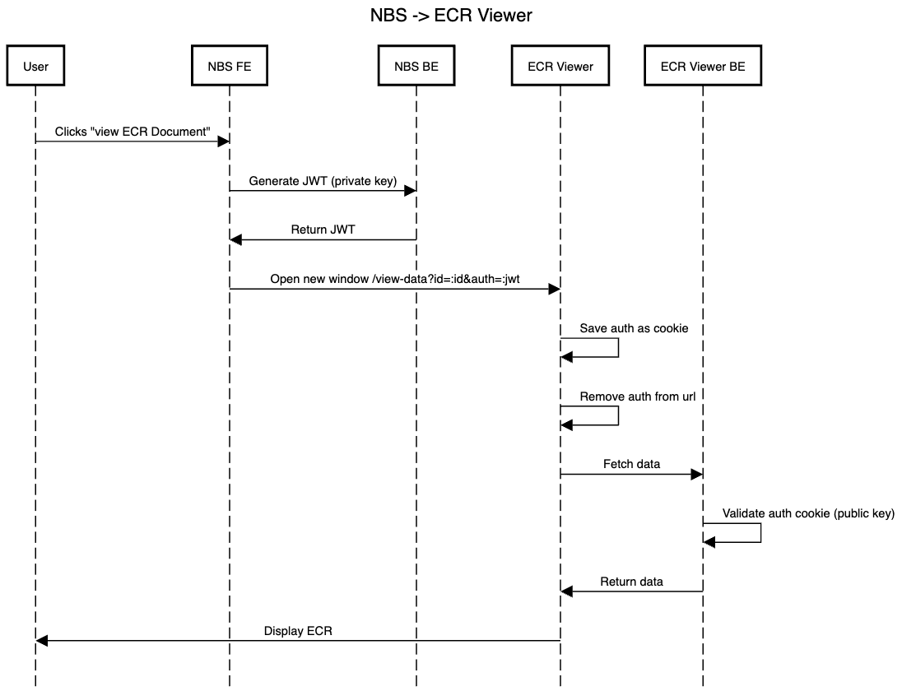

# View eCR

Display an eCR

**URL** : `/view-data?id=:id&snomed-code=:snomed&auth=:auth`

**URL Parameters** : 
- `id=[string]` where `id` is the ID of the eCR.
- `snomed-code=[string]` where `snomed-code` is the condition the user is viewing the eCR for. OPTIONAL.
- `auth=[string]` where `auth` is the authentication token for the user. Only required if app_env is production.

**Method** : `GET`

**Auth required** : YES

**Permissions required** : None

## Example Architecture

## Success Response

**Condition** : eCR exists and authentication is valid.

**Code** : `200 OK`

**Content** : eCR will be displayed to the user

## Error Responses

**Condition** : eCR does not exist with `id`

**Code** : `404 NOT FOUND`

**Content** : Error will be displayed to user

### Or

**Condition** : Authentication is invalid

**Code** : `401 UNAUTHORIZED`

**Content** : Error will be displayed to user
