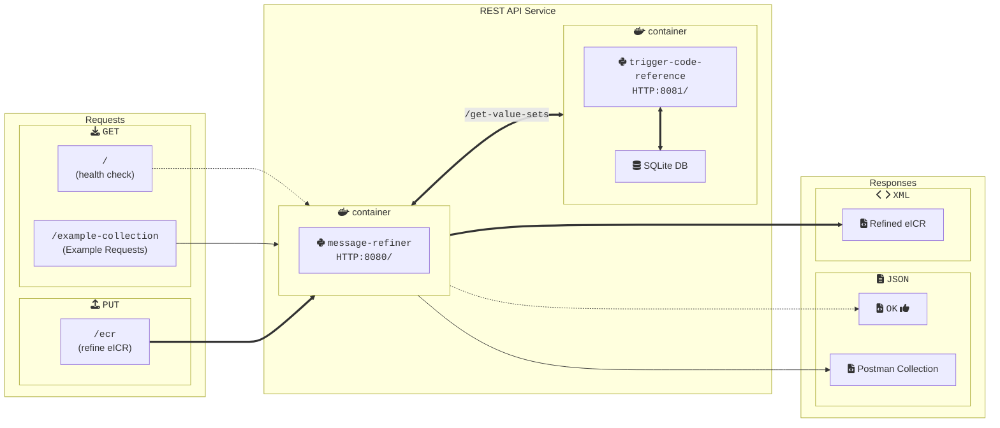

# Message Refiner

```mermaid
flowchart LR

  subgraph requests["Requests"]
    direction TB
    subgraph GET["fas:fa-download <code>GET</code>"]
      hc["<code>/</code>\n(health check)"]
      example["<code>/example-collection</code>\n(Example Requests)"]
    end
    subgraph PUT["fas:fa-upload <code>PUT</code>"]
      ecr["<code>/ecr</code>\n(refine eICR)"]
    end
  end


  subgraph service[REST API Service]
    direction TB
    subgraph mr["fab:fa-docker container"]
      refiner["fab:fa-python <code>message-refiner<br>HTTP:8080/</code>"]
    end
    subgraph tcr["fab:fa-docker container"]
      tcr-service["fab:fa-python <code>trigger-code-reference<br>HTTP:8081/</code>"] <==> db["fas:fa-database SQLite DB"]
    end
    mr <==> |<code>/get-value-sets</code>| tcr
  end

  subgraph response["Responses"]
    subgraph JSON["fa:fa-file-alt <code>JSON</code>"]
      rsp-hc["fa:fa-file-code <code>OK</code> fa:fa-thumbs-up"]
      rsp-example["fa:fa-file-code Postman Collection"]
    end
    subgraph XML["fas:fa-chevron-left fas:fa-chevron-right <code>XML</code>"]
      rsp-ecr["fas:fa-file-code Refined eICR"]
    end
  end

hc -.-> mr -.-> rsp-hc
example --> mr --> rsp-example
ecr ===> mr ===> rsp-ecr
```
