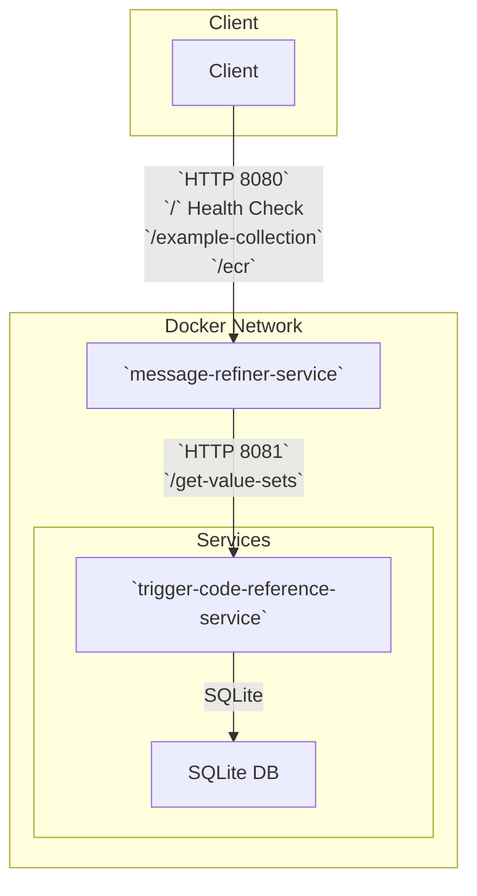

# Message Refiner

```mermaid

graph TD;
    subgraph Client
        A[Client]
    end
    subgraph Docker Network
        direction TB
        B[`message-refiner-service`]
        subgraph Services
            direction LR
            C[`trigger-code-reference-service`]
            D[SQLite DB]
        end
    end
    A -->|`HTTP 8080`\n`/` Health Check\n`/example-collection`\n`/ecr`| B
    B -->|`HTTP 8081`\n`/get-value-sets`| C
    C -->|SQLite| D
```
