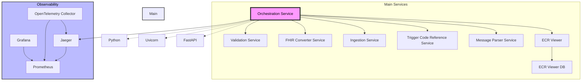

## Getting Started with the DIBBs Orchestration

### Introduction
The DIBBs Orchestration service offers a REST API for processing messages through a series of microservices.

### Running Orchestration

You can run the Orchestration service using Docker, any other OCI container runtime (e.g., Podman), or directly from the Python source code. 

### Running Orchestration tests
#### Running Unit Tests
1. `cd containers/orchestration`
2. `eval "$(pyenv init -)"`
3. `source .venv/bin/activate`
4. `pip install -r requirements.txt`
5. `python -m pytest --cov-report xml --cov=. -m "not integration" tests/`

#### Running Integration Tests
1. `cd containers/orchestration`
2. `eval "$(pyenv init -)"`
3. `source .venv/bin/activate`
4. `pip install -r requirements.txt`
5. `python -m pytest -m "integration"`

#### Running with Docker (Recommended)

To run the Orchestration service with Docker, follow these steps.
1. Confirm that you have Docker installed by running `docker -v`. If you don't see a response similar to what's shown below, follow [these instructions](https://docs.docker.com/get-docker/) to install Docker.
```
❯ docker -v
Docker version 20.10.21, build baeda1f
``` 
2. Download a copy of the Docker image from the PHDI repository by running `docker pull ghcr.io/cdcgov/phdi/orchestration:latest`.
3. Run the service with ` docker run -p 8080:8080 orchestration:latest`.

Congratulations, the Orchestration service should now be running on `localhost:8080`!

#### Running from Python Source Code

We recommend running the Orchestration service from a container, but if that isn’t feasible for a given use case, you can also run the service directly from Python using the steps below.

1. Ensure that both Git and Python 3.10 or higher are installed.
2. Clone the PHDI repository with `git clone https://github.com/CDCgov/phdi`.
3. Navigate to `/phdi/containers/orchestration/`.
4. Make a fresh virtual environment with `python -m venv .venv`.
5. Activate the virtual environment with `source .venv/bin/activate` (MacOS and Linux), `venv\Scripts\activate` (Windows Command Prompt), or `.venv\Scripts\Activate.ps1` (Windows Power Shell).
5. Install all of the Python dependencies for the Orchestration service with `pip install -r requirements.txt` into your virtual environment.
6. Run the Orchestration service on `localhost:8080` with `python -m uvicorn app.main:app --host 0.0.0.0 --port 8080`. 

### Building the Docker Image

To build the Docker image for the Orchestration service from source instead of downloading it from the PHDI repository follow these steps.
1. Ensure that both [Git](https://git-scm.com/book/en/v2/Getting-Started-Installing-Git) and [Docker](https://docs.docker.com/get-docker/) are installed.
2. Clone the PHDI repository with `git clone https://github.com/CDCgov/phdi`.
3. Navigate to `/phdi/containers/orchestration/`.
4. Make a fresh virtual environment with `python -m venv .venv`.
5. Activate the virtual environment with `source .venv/bin/activate` (MacOS and Linux), `venv\Scripts\activate` (Windows Command Prompt), or `.venv\Scripts\Activate.ps1` (Windows PowerShell).
6. Install all Python dependencies for the validation service with `pip install -r requirements.txt` into your virtual environment.
7. Run `npm run local-dev`.

### The API 

When viewing these docs from the `/redoc` endpoint on a running instance of the Orchestration service or the DIBBs website, detailed documentation on the API will be available below. 

### Running the /process-zip endpoint
When processing an eCR .zip file through the Orchestration service, call the `/process-zip` endpoint to run the file. 

The endpoint will be a POST call to the `/process-zip` endpoint with the following parameters in the form body

- `message_type`: The type of stream of the uploaded file's underlying data (e.g. ecr, elr, etc.). If the data is in FHIR format, set to FHIR.
- `include_error_types`: The type of errors to return (e.g. warnings, errors, fatal).
- `data_type`: The type of data held in the uploaded file. Eligible values include `ecr`, `zip`, `fhir`, and `hl7`. In most cases it will be zip
- `config_file_name`: The name of the configuration file to load on the service's back-end, specifying the workflow to apply. These are uploaded by the organization hosting the application. There are samples of these files in the /assets folder of this application
- `upload_file`: A file containing clinical health care information. 

An an example of calling this endpoint would look like this 

```
curl --location 'https://your_url_here/orchestration/process-zip' \
--form 'message_type="ecr"' \
--form 'include_error_types="[errors]"' \
--form 'config_file_name="sample-orchestration-s3-config.json"' \
--form 'upload_file=@"/path_to_your_zip/sample.zip"' \
--form 'data_type="zip"'
```

The output will vary depending on the type of configuration chosen. However, the process will have status `200` indicating it did not encounter errors when running the Orchestration service.

For more information on the endpoint go to the documentation [here](https://cdcgov.github.io/phdi/latest/containers/orchestration.html)

### Architecture Diagram

#### Application Stack



#### Application API

```mermaid
graph TD
    A[Orchestration Service]

    subgraph API Endpoints
        direction TB
        M[GET /configs]
        N[GET /configs&#123;processing_config_name&#125;]
        O[PUT /configs&#123;processing_config_name&#125;]
        P[POST /process-zip]
        Q[POST /process-message]
        R[WebSocket /process-ws]
    end

    A --> M
    A --> N
    A --> O
    A --> P
    A --> Q
    A --> R

    style A fill:#f9f,stroke:#333,stroke-width:4px,color:#000
    style API Endpoints fill:#bfb,stroke:#333,stroke-width:2px
```

