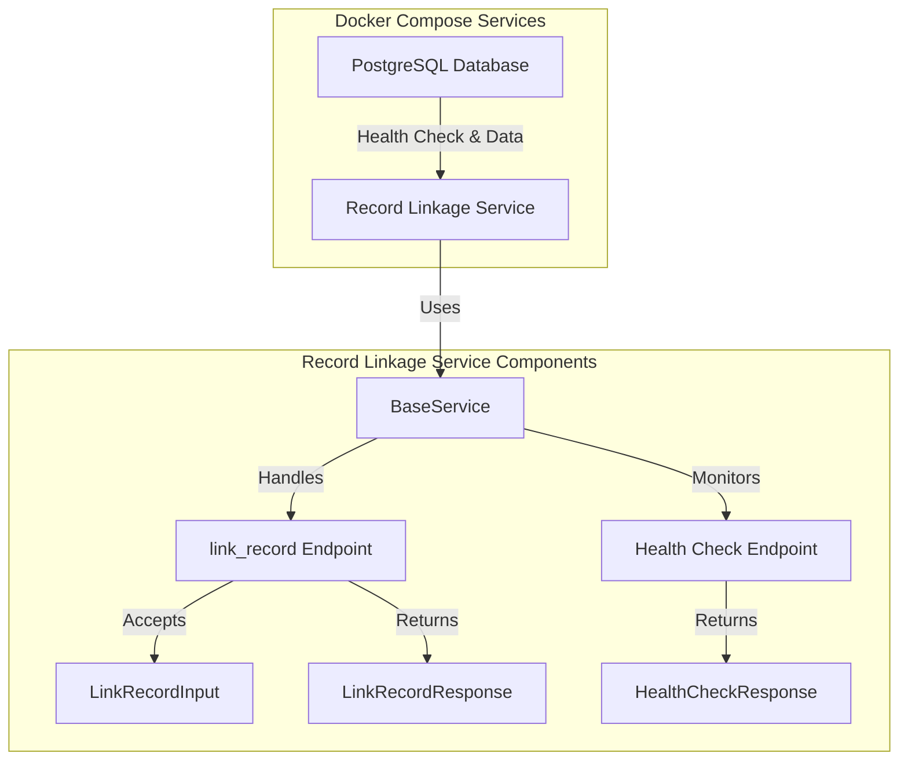

## Getting Started with the DIBBs Record Linkage Service

### Introduction
The DIBBs record linkage service offers a REST API for linking new health care messages to existing records if a connection exists.

### Running the Record Linkage Service

You can run the Record Linkage service using Docker, any other OCI container runtime (e.g., Podman), or directly from the Python source code.

#### Running with Docker Compose (Recommended)

To run the Record Linkage service with Docker Compose follow these steps.
1. Confirm that you have Docker installed by running `docker -v`. If you don't see a response similar what's shown below, follow [these instructions](https://docs.docker.com/get-docker/) to install Docker.
```
❯ docker -v
Docker version 20.10.21, build baeda1f
```

2. Navigate to the `containers/record-linkage` folder and start the service by running `docker compose up --build`

Congratulations the Record Linkage service should now be running on `localhost:8080`!

#### Running with Docker

To run the Record Linkage service with Docker follow these steps.
1. Confirm that you have Docker installed by running `docker -v`. If you do not see a response similar to what is shown below, follow [these instructions](https://docs.docker.com/get-docker/) to install Docker.
```
❯ docker -v
Docker version 20.10.21, build baeda1f
``` 
2. Download a copy of the Docker image from the DIBBs repository by running `docker pull ghcr.io/cdcgov/phdi/record-linkage:latest`.
3. Run the service with ` docker run -p 8080:8080 record-linkage:latest`.

Congratulations, the Record Linkage service should now be running on `localhost:8080`!

#### Running from Python Source Code

We recommend running the Record Linkage service from a container, but if that isn't feasible for a given use case, you can also run the service directly from Python using the steps below. 

1. Ensure that both Git and Python 3.10 or higher are installed.
2. Clone the DIBBs repository with `git clone https://github.com/CDCgov/phdi`.
3. Navigate to `/phdi/containers/record-linkage/`.
4. Make a fresh virtual environment with `python -m venv .venv`.
5. Activate the virtual environment with `source .venv/bin/activate` (MacOS and Linux), `venv\Scripts\activate` (Windows Command Prompt), or `.venv\Scripts\Activate.ps1` (Windows PowerShell).
5. Install all Python dependencies for the record linkage service with `pip install -r requirements.txt` into your virtual environment.
6. Run the record linkage service on `localhost:8080` with `python -m uvicorn app.main:app --host 0.0.0.0 --port 8080 --log-config app/log_config.yml`. 

### Building the Docker Image

To build the Docker image for the Record Linkage service from source code instead of downloading it from the DIBBs repository follow these steps.
1. Ensure that both [Git](https://git-scm.com/book/en/v2/Getting-Started-Installing-Git) and [Docker](https://docs.docker.com/get-docker/) are installed.
2. Clone the DIBBs repository with `git clone https://github.com/CDCgov/phdi`.
3. Navigate to `/phdi/containers/record-linkage/`.
4. Run `docker buildx build --platform linux/amd64 -t validation .`.

### The API 

When viewing these docs from the `/redoc` endpoint on a running instance of the Record Linkage service or the DIBBs website, detailed documentation on the API will be available below. 

### Architecture Diagram

