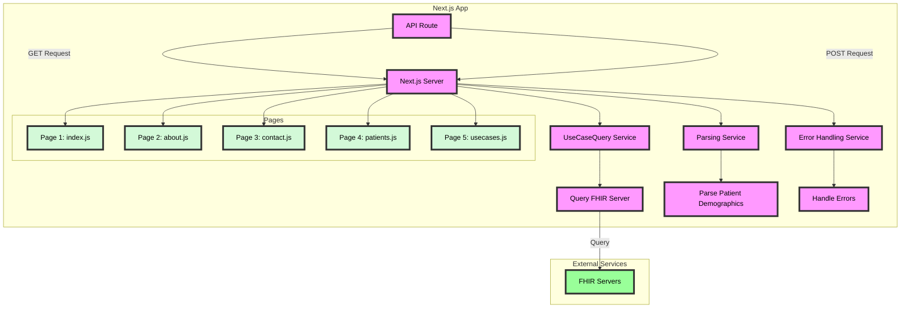

## Getting Started with TEFCA Viewer

### Introduction

The DIBBs TEFCA Viewer app offers a REST API for searching for a patient and viewng information tied to your case investigation.

### Running TEFCA Viewer

The TEFCA Viewer app can be run using Docker (or any other OCI container runtime e.g., Podman), or directly from the Node.js source code.

#### Running with Docker (Recommended)

To run the TEFCA Viewer app with Docker, follow these steps.

1. Confirm that you have Docker installed by running `docker -v`. If you do not see a response similar to what is shown below, follow [these instructions](https://docs.docker.com/get-docker/) to install Docker.

```
❯ docker -v
Docker version 20.10.21, build baeda1f
```

2. Download a copy of the Docker image from the PHDI repository by running `docker pull ghcr.io/cdcgov/phdi/tefca-viewer:latest`.
   1. If you're using an M1 Mac, you'll need to tell docker to pull the non-Apple Silicon image using `docker pull --platform linux/amd64 ghcr.io/cdcgov/phdi/tefca-viewer:latest`. If you're using this setup, there might be some issues with architecture incompatability that the team hasn't run into, so please flag if you run into something!
3. Run the service with `docker run -p 3000:3000 tefca-viewer:latest`. If you're on a windows machine, you may need to run `docker run -p 3000:3000 ghcr.io/cdcgov/phdi/tefca-viewer:latest` instead.

Congratulations, the TEFCA Viewer app should now be running on `localhost:3000/tefca-viewer`!

#### Running from Node.js Source Code

We recommend running the TEFCA Viewer app from a container, but if that is not feasible for a given use-case, it may also be run directly from Node using the steps below.

1. Ensure that both Git and Node 18.x or higher are installed.
2. Clone the PHDI repository with `git clone https://github.com/CDCgov/phdi`.
3. Navigate to `/phdi/containers/tefca-viewer/`.
4. Install all of the Node dependencies for the TEFCA Viewer app with `npm install`.
5. Run the TEFCA Viewer app on `localhost:3000` with `npm run dev`. If you are on a Windows Machine, you may need to run `npm run dev-win` instead.

### Building the Docker Image

To build the Docker image for the TEFCA Viewer app from source instead of downloading it from the PHDI repository follow these steps.

1. Ensure that both [Git](https://git-scm.com/book/en/v2/Getting-Started-Installing-Git) and [Docker](https://docs.docker.com/get-docker/) are installed.
2. Clone the PHDI repository with `git clone https://github.com/CDCgov/phdi`.
3. Navigate to `/phdi/containers/tefca-viewer/`.
4. Run `docker build -t tefca-viewer .`.

### Running via docker-compose (WIP)

The TEFCA Viewer will eventually require other inputs from other DIBBs services. For now, this is a simplified docker compose file that starts the Node service. This can be run with `docker compose up --build`. See the [Docker Compose documentation](https://docs.docker.com/engine/reference/commandline/compose_up/) for additional information.

### Developer Documentation

Can be found in [api-documentation.md](api-documentation.md).

### Architecture Diagram


