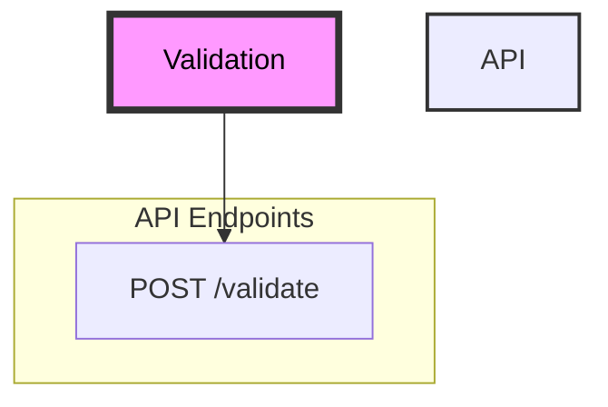

## Getting Started with the DIBBs Validation Service

### Introduction
The DIBBs Validation service offers a REST API for validating healthcare messages (e.g., whether  messages are in the proper format and contain user-defined fields of interest).

### Running the Validation Service

You can run the Validation service using Docker, any other OCI container runtime (e.g., Podman), or directly from the Python source code. 

#### Running with Docker (Recommended)

To run the Validation service with Docker, follow these steps.
1. Confirm that you have Docker installed by running docker -v. If you don't see a response similar to what's shown below, follow [these instructions](https://docs.docker.com/get-docker/) to install Docker.
```
❯ docker -v
Docker version 20.10.21, build baeda1f
``` 
2. Download a copy of the Docker image from the PHDI repository by running `docker pull ghcr.io/cdcgov/phdi/validation:latest`.
3. Run the service with `docker run -p 8080:8080 validation:latest`.

Congratulations, the Validation service should now be running on `localhost:8080`! 

#### Running from Python Source Code

We recommend running the Validation service from a container, but if that isn't feasible for a given use case,  you can also run the service directly from Python using the steps below.

1. Ensure that both Git and Python 3.10 or higher are installed.
2. Clone the PHDI repository with `git clone https://github.com/CDCgov/phdi`.
3. Navigate to `/phdi/containers/validation/`.
4. Make a fresh virtual environment with `python -m venv .venv`.
5. Activate the virtual environment with `source .venv/bin/activate` (MacOS and Linux), `venv\Scripts\activate` (Windows Command Prompt), or `.venv\Scripts\Activate.ps1` (Windows PowerShell).
5. Install all Python dependencies for the validation service with `pip install -r requirements.txt` into your virtual environment.
6. Run the FHIR Converter on `localhost:8080` with `python -m uvicorn app.main:app --host 0.0.0.0 --port 8080`. 

### Building the Docker Image

To build the Docker image for the Validation service from source code instead of downloading it from the PHDI repository, follow these steps.
1. Ensure that both [Git](https://git-scm.com/book/en/v2/Getting-Started-Installing-Git) and [Docker](https://docs.docker.com/get-docker/) are installed.
2. Clone the PHDI repository with `git clone https://github.com/CDCgov/phdi`.
3. Navigate to `/phdi/containers/validation/`.
4. Run `docker build -t validation .`.

### The API 

When viewing these docs from the `/redoc` endpoint on a running instance of the Validation service or the DIBBs website, detailed documentation on the API will be available below.

## Diagrams and Sample Requests

### Sample Request

The request must have these keys included. The `message` must be escaped
```
{
    "message_type": "ecr",
    "include_error_types": "errors",
    "message": "<ClinicalDocument xmlns=\\\"urn:hl7-org:v3\\\" xmlns:xsi=\\\"http://www.w3.org/2001/XMLSchema-instance\\\">\\n<realmCode code=\\\"US\\\"/>\\n<typeId extension=\\\"POCD_HD000040\\\" root=\\\"2.16.840.1.113883.1.3\\\"/>\\n<templateId root=\\\"1.2.840.114350.1.72.1.51693\\\"/>\\n<templateId root=\\\"2.16.840.1.113883.10.20.22.1.1\\\"/>\\n<templateId extension=\\\"2015-08-01\\\" root=\\\"2.16.840.1.113883.10.20.22.1.1\\\"/>\\n<templateId extension=\\\"2016-12-01\\\" root=\\\"2.16.840.1.113883.10.20.15.2\\\"/>\\n<id root=\\\"8675309a-7754-r2d2-c3p0-973d9f777777\\\"/>\\n<code code=\\\"55751-2\\\" codeSystem=\\\"2.16.840.1.113883.6.1\\\" codeSystemName=\\\"LOINC\\\" displayName=\\\"Initial Public Health Case Report\\\"/>\\n<title>Initial Public Health Case Report</title>\\n<effectiveTime value=\\\"20230409130417-0700\\\"/>\\n<confidentialityCode code=\\\"N\\\" codeSystem=\\\"2.16.840.1.113883.5.25\\\" displayName=\\\"Normal\\\"/>\\n<languageCode code=\\\"en-US\\\"/>\\n<setId assigningAuthorityName=\\\"EPC\\\" extension=\\\"8675309a-7754-r2d2-c3p0-973d9f777777\\\" root=\\\"1.2.840.114350.1.13.297.3.7.1.1\\\"/>\\n<versionNumber value=\\\"2\\\"/>\\n<recordTarget>\\n<patientRole>\\n<id extension=\\\"MRN1234567890\\\" root=\\\"1.2.840.114350.1.13.297.3.7.3.688884.100\\\"/>\\n<addr use=\\\"HP\\\">\\n<streetAddressLine>4720 MEGA ST. NW</streetAddressLine>\\n<city>NORTH CANTON</city>\\n<state>OH</state>\\n<postalCode>44720</postalCode>\\n<country>USA</country>\\n<useablePeriod xmlns:xsi=\\\"http://www.w3.org/2001/XMLSchema-instance\\\" xsi:type=\\\"IVL_TS\\\">\\n <low value=\\\"20181129\\\"/>\\n<high nullFlavor=\\\"NA\\\"/>\\n</useablePeriod>\\n</addr>\\n<telecom nullFlavor=\\\"UNK\\\"/>\\n<patient>\\n<name use=\\\"L\\\">\\n<given>Jon</given>\\n<family>Shepherd</family>\\n<validTime>\\n<low nullFlavor=\\\"NA\\\"/>\\n<high nullFlavor=\\\"NA\\\"/>\\n</validTime>\\n</name> ... </ClinicalDocument>"
}
```

### Application API

