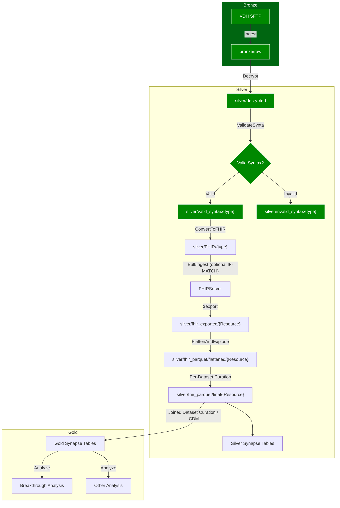

# 0003 Working with FHIR Data

Date: Feb 22, 2022

## Status

Proposed

## Context and Problem Statement

We have a number of operations we need to perform against FHIR-formatted data. In particular:

- **Conversion** of HL7 to FHIR
- **Validation** against a FHIR Profile
- **Storage** of FHIR-formatted records
  - **Import** of incoming data into the storage mechanism
  - **Export** of this data for easier analysis
- **Linkage** of both incoming and generated data. In particular:
  - **Bundle linkage**:Cross-resource linkages associated with a single originating message, e.g. `Patient` -> `Observation`
  - **Patient linkage**: Intra-resource "real-world"/conceptual linkages, e.g. two separate originating messages that correspond to the same `Patient`
  - **Analysis linkage**: Cross-message linkages associated with multiple originating messages, e.g. Lab -> Shot -> Case
- **Curation** / transformation of this data
- **Standardization** of data into known formats

We should discuss the various options available in this space and how we could leverage these to solve our problems.

## Decision Drivers

As an overarching concern, in addition to answering the above questions, we are working on a time-limited prototype and need quick results, and this is our primary driver. Notably though, we should not close doors for future enhancements along the way.

The below principles should guide our reasoning:

- **Consistency** - Closeness to architecture from "Data Engineering With Apache Spark, Delta Lake, and Lakehouse" to enable speed of implementation
- **Simplicity** - Solution must be simple and easy to both understand and implement
- **Composability** - Ability to break off pieces of functionality for other purposes and progressively enhance longer-term solutions
- **Extensibility** - We can build on this in the future

## Considered Options

1. All standalone services

   1. Diagram:

1. Pros:
   1. **Consistency** - no need for a server intermediary
   2. **Composability** - we can use individual parts of what is usually bundled with the FHIR server such as [FHIR-Converter](https://github.com/microsoft/FHIR-Converter) and [FHIR Validator](https://www.hl7.org/fhir/validation.html) without needing the server itself to improve our ability to swap things out in the future.
2. Cons:

   1. **Simplicity** - FHIR bundles are more difficult to work with than single-resource exports. In theory we could use something like [Bunsen](https://github.com/cerner/bunsen), but this project apparently does not support FHIR R4 and there are no plans to do so ([ref](https://stackoverflow.com/questions/63652256/what-are-the-dependencies-that-will-allow-cerner-bunsen-to-load-fhir-r4-ukcore)).
   2. **Speed** - Though the various tools are available as standalone, host-it-yourself options, the need to stand these up as separate services would be prohibitive in the prototype period.

3. FHIR Server at the end of the pipeline

4. Diagram:

1. Pros:
   1. **Extensibility** - FHIR server is used for both storage and interface - We could potentially expose an API in the future
   2. **Consistency** - Imposing a structured database at the end of the pipeline may be the most consistent with the book's infrastructure
2. Cons:

   1. **Simplicity** - Non-FHIR properties will be truncated when entered into the FHIR Server; these need a new home that requires new infrastructure

3. FHIR Server in the middle of the pipeline

4. Diagram:

1. Pros:
   1. **Simplicity** - we benefit from the FHIR Server's ingest abilities to coalesce resources from a single message
2. Cons:

   1. **Simplicity** - This takes the path of unstructured->structured->unstructured->structured
   2. **Consistency** - we will lose our curation upon bulk ingest into the FHIR server

3. FHIR Server at the beginning of the pipeline

4. Diagram:

1. Pros:
   1. **Simplicity**
      1. The FHIR server links our per-resource requests, at first "soft linking" via references and then later hard-linking by using "if-match" [criteria](https://www.hl7.org/fhir/http.html#concurrency)
      2. It provides out of the box storage and a managed database
      3. It provides ready-made, packaged and deployable functions that we can use without needing to re-implement or re-host in the short-term:
         1. `$convert-data` - HL7 -> FHIR
         2. `$validate` - apply FHIR profile to data
         3. `$export` - export data
         4. `$match` - annotate linked records
         5. Through [FHIR Proxy](https://github.com/microsoft/fhir-proxy), Bulk Insertion and pre/post-processeing. We would need to add this on separately
   2. **Consistency** - this lets us work with FHIR data right from the start of our pipeline and then treat it as flat files going forward
   3. **Composability** - having this functionality encapsulated in specific endpoints could let us peel these off if need be
2. Cons:
   1. **Extensibility** - up front, at least, this ties us into the Microsoft ecosystem. We should be careful to cordon off specific functionality with dedicated microservices to enable working around this.
   2. **Simplicity** - We do technically still go from unstructured->structured->unstructured->structured , though there are benefits to this
3. Detailed Diagram. The below diagram gives a detailed breakdown of the phases of ingestion and represents the latest thinking around architecture:

## Decision Outcome

Importing the data into the FHIR Server right at the beginning of the pipeline maximizes simplicity, consistency, and ease of implementation for the prototype period - we get a lot out of the box and can move quickly to focus on data quality enhancements to flat files. Additionally, it doesn't cut us off from future enhancements and extensions.

## Open Questions

- Is Microsoft's server the best option here? We've seen indications that there might be limitations at scale, though all of these servers have this limitation: ([ref](https://vneilley.medium.com/most-fhir-servers-are-unusable-in-production-8833cb1480b1))
- Further investigation is necessary to determine where and how to incorporate the various constituent operations that the FHIR server provides. We leave this up to a further decision record or records as we discover more through research.

## Appendix

- [Azure API For FHIR](https://docs.microsoft.com/en-us/azure/healthcare-apis/azure-api-for-fhir/overview)
