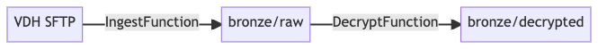

# Getting Started

Below is a guide for getting started on development of the PRIME PHDI Data Ingestion project. You'll find resources on how to setup a local development environment, how we do deployments, and more.

- [Getting Started](#getting-started)
  - [Architecture](#architecture)
  - [Local Development Environment](#local-development-environment)
    - [Hardware](#hardware)
    - [VSCode](#vscode)
    - [Testing](#testing)
      - [Pre-requisites](#pre-requisites)
      - [A note on files](#a-note-on-files)
      - [Sensitive information](#sensitive-information)
      - [Python](#python)
        - [Development dependencies](#development-dependencies)
        - [What is the VSCode Azure integration actually doing?/](#what-is-the-vscode-azure-integration-actually-doing)
        - [Dependencies](#dependencies)
        - [Testing Python](#testing-python)
  - [Docker container development](#docker-container-development)

## Architecture

As of 2/2/22, the below diagram represents our current high-level system architecture:



We use [Azure Functions](https://docs.microsoft.com/en-us/azure/azure-functions/), along with a combination of [HTTP Triggers](https://docs.microsoft.com/en-us/azure/azure-functions/functions-bindings-http-webhook-trigger) and [Blob Triggers](https://docs.microsoft.com/en-us/azure/azure-functions/functions-bindings-storage-blob-trigger) to move data from an SFTP server to a dedicated blob storage, and then to perform additional operations against this data.

The below char summarizes these functions, their purposes, triggers, inputs, and outputs:

| Name            | Language | FunctionApp           | Purpose                                                                                        | Trigger                                 | Input                                                                                                            | Output                                                          | Effect                                                                                                                                      |             |         |         |       |        |        |
| --------------- | -------- | --------------------- | ---------------------------------------------------------------------------------------------- | --------------------------------------- | ---------------------------------------------------------------------------------------------------------------- | --------------------------------------------------------------- | ------------------------------------------------------------------------------------------------------------------------------------------- | ----------- | ------- | ------- | ----- | ------ | ------ |
| GeocodeAddress  | Python   | PHDISmartyStreetsTest | Use the SmartyStreets API to parse and validate a passed-in address and return component parts | HTTP                                    | Address string via an "address" parameter                                                                        | {"input": "{INPUT ADDRESS}", "results": [{ADDRESS_COMPONENTS}]} | N/A                                                                                                                                         |             |         |         |       |        |        |
| IngestFunction  | Python   | pitest-functionapp    | Pull in eICR, VXU, and ELR messages from the VDH SFTP server                                   | HTTP                                    | N/A - input params not used                                                                                      | HTTP Status codes - 200 for success, 500 for failure            | Data is copied from VDH SFTP server to the pitestadtastorage storage account, in the "bronze" container, into a virtual folder called "raw" |             |         |         |       |        |        |
| DecryptFunction | Python   | pitest-functionapp    | Use our team private key to decrypt messages in the "raw" folder and output to "decrypted"     | BlobTrigger on path "bronze/raw"        | A blob trigger, operating on files present in the "bronze/raw" directory. Can optionally be passed file contents | N/A                                                             | Data in "pitestdata/bronze/raw" is decrypted, and moved to "pitestdata/bronze/decrypted"                                                    |             |         |         |       |        |        |
| DSTP            | Kotlin   | TBD                   | Take in HL7 data (flat file or XML), and return a JSON representation of this data             | Currently HTTP, may move to BlobTrigger | HL7 flat file or XML                                                                                             | N/A                                                             | Decrypted HL7 data is parsed and output to a specified directory                                                                            | FunctionApp | Purpose | Trigger | Input | Output | Effect |

## Local Development Environment

The below instructions cover how to setup a development environment for local development of functions

### Hardware

Until we have properly containerized our apps, we will need to rely on informal consensus around hardware. The most common setup on the team is VSCode running on a Mac. It's worth nothing, though, that M1 macs are unable to run the `azure-functions-core-tools` package directly (and even have difficulty running it through Rosetta). Windows-based machines that are running Windows 10/11 Home or higher are viable options as well. However, as the work moves towards containerization, Windows Pro will be necessary in order to run Docker. Each setup will have its own pros and cons, so choose the setup that works best for you, while keeping in mind the tech stack needs, which are defined below.

### Software

#### Overview
The team uses VSCode as its IDE, but other options (e.g. IntelliJ, Eclipse, PyCharm, etc.) can be viable as well. The main drivers behind using VSCode are its integration with Azure, which is a natural byproduct of them both being Microsoft-owned prodcuts, and the amount of documentation that exists to help get the environment setup. The rest of this document will assume that you're using VSCode as your IDE.

The project itself is coded primarily in Python, with some functionality written in Kotlin. While Python is used for most of the data-related tasks, Kotlin is used in the early stages to deal with the raw HL7 data due to the mature, robust [HAPI](https://hapifhir.github.io/hapi-hl7v2/) API, which is written in Java. Choosing to use Kotlin instead of Java is based on the fact that ReportStream, a related project, uses Kotlin and we wanted to minimize frictions in any code sharing or integrations that might take place.

Lastly, there are some dependencies that the team makes use of in order to test Azure functionality locally, which include [Azurite](https://docs.microsoft.com/en-us/azure/storage/common/storage-use-azurite?tabs=visual-studio), [Azure Core Function Tools](https://docs.microsoft.com/en-us/azure/azure-functions/functions-run-local), and the .NET Core SDK. Azurite is a storage emulator, which will let you mock Azure's different data storage options, such as Tables, Queues, and Blobs. Azure Core Function Tools are the heart of what allows you to develop Azure functionality locally, and the .NET Core SDK is used for some of the functionality you might develop. For example, when building Azure Functions in Java, the .NET framework provides access to bindings (e.g `@BlobTrigger`) that you'll need. 

#### Installation
1. Install the latest version of [VSCode](https://code.visualstudio.com/download) (or use `brew install vscode`).
2. Install the [Azure Core Function Tools](https://docs.microsoft.com/en-us/azure/azure-functions/functions-run-local), but be sure to install the 3.x version, and not 4.x. 4.x does not work with all Azure functionality as well as one might hope.
3. Install the [.NET Core SDK 3.1](https://dotnet.microsoft.com/en-us/download/dotnet/3.1). Versions 5.0 and 6.0 do not seem to work well with the 3.x Azure Core Function Tools.

In the next section, "Developing Azure Locally", we'll go over which Extensions you need to install, including the Azurite Extension, in order to begin developing Azure functionality.

### Developing Azure Locally

At a high level, we follow the guide [here](https://docs.microsoft.com/en-us/azure/azure-functions/functions-develop-vs-code) for how to set up Azure Functions directly for integration with VSCode. As mentioned previously, it's possible to use alternative means of working with these functions, but this represents the path that we have found to be well documented and to make certain operations easier. To get started with developing Azure functionality in VSCode efficiently, you first need to install some useful extensions.

#### Extensions

If you prefer to minimize what gets installed on your machine, you can install each of the following extensions, which should provide the functionality that you need.

**Azure CLI Tools**  
These are the tools for developing and running commands for the Azure CLI, which is what's needed when you want to run your Azure Functions locally. 

**Azure Account**  
This is the extension used to sign into Azure and manage your subscription. Be sure to sign in to your CDC Superuser Account once you've installed this extension.

**Azure Functions**  
This is the core extension needed to build the Azure Functions locally.

**Azure Resources**  
This extension isn't explictly necessary, but can be helpful to view and manage Azure resources.

**Azurite**  
This is another core extension to install as it allows you to mock Azure's data storage tools like Tables, Queues, and Blobs so that you can store and access data locally as if you were engaging with those tools. There are other ways to install Azurite, such as with `npm` or Docker, but working with it through the extension works as well. If you'd like to install this via Docker or npm, you can see the installation instructions [here](https://docs.microsoft.com/en-us/azure/storage/common/storage-use-azurite?tabs=npm).

If you'd prefer to minimize the amount of things you need to install yourself, you can install a single extension, which will provide all of those listed above plus more.

**Azure Tools**  
This extension installs 12 different extensions, which include the five listed above as well as Docker, Azure App Service, Azure Resource Manager, Azure Databases, Azure Storage, Azure Pipelines, and Azure Virtual Machines. If you find yourself needing these extensions, or believe you'll need them in the future, then installing this one extension could be worth it.

_Note: At various points in your project, VS Code may ask you if you want to optimize for use with the tools. If so, be sure to click yes to optimize._

#### Testing

Before diving into the specifics of working with Python and Java/Kotlin, it's worth covering how testing Azure Functionality in VS Code in general works, which is outlined below.

* As long as you have the Azure Functions extension installed (as described above), then you can either click the `Run -> Debug` button (the one that looks like the sideways triangle with the bug) or press `F5` to run the Function.  
* The second thing you'll need implemented is the Azurite storage extension described above. If you've installed this through the VS Code extension, then you can start the container by clicking one of the three buttons in the bottom-right tray of VS Code, which will saying "Azurite Table Service", "Azurite Queue Service", or "Azurite Blob Service". If you've installed Azurite using npm or Docker, use [the documentation](https://docs.microsoft.com/en-us/azure/storage/common/storage-use-azurite?tabs=npm) to work through how to start the service.  
* To use this container, set your connection string to `UseDevelopmentStorage=true`as detailed [here](https://docs.microsoft.com/en-us/azure/storage/common/storage-use-azurite?tabs=visual-studio).

#### Python

Microsoft maintains a pretty good guide [here](https://docs.microsoft.com/en-us/azure/azure-functions/functions-reference-python?tabs=asgi%2Cazurecli-linux%2Capplication-level) for developing Azure functions with Python. We've followed this guide wherever possible, it's worth a look for reference.

##### Development Dependencies

We've added a handful of development-only dependencies at `requirements_dev.txt`. Install these with `source .venv/bin/activate; pip install -r requirements_dev.txt`.

These include:

- [Black](https://black.readthedocs.io/en/stable/) - automatic code formatter that enforces PEP best practices
- [mypy](http://mypy-lang.org/) - enables static typing for python
- [pytest](https://docs.pytest.org/en/6.2.x/) - for easy unit testing

##### What is the VSCode Azure Integration Actually Doing?

Under the hood, this integration is doing the following:

1. Creates a virtual environment (default path `.venv`) and installing all depedencies called out in `requirements.txt`. You can alternatively do this yourself with `source .venv/bin/activate; pip install -r requirements.txt`.
2. Creates `.vscode/tasks.json`, which make it easier to activate the relevant virtual environment, installs dependencies, and starts a debugging session
3. Creates `.vscode/launch.json`, which makes it so that when you hit F5 / go to `Run->Start Debugging` it runs the tasks from (2) and then attaches to the debugger for your functions when running locally.

##### Dependencies

To add a new dependency, add it to `requirements.txt` if it is critical to run the app, and `requirements_dev.txt` if it helps local development. You can manually install these dependencies using `source .venv/bin/activate; pip install -r requirements.txt` or using the built-in F5 action provided by the Azure extension.

Deploying the function app will result in it automatically installing the dependencies in `requirements.txt`.

##### Testing Python

We use [pytest](https://docs.pytest.org/en/6.2.x/) for the purpose of unit testing functions. All functions should have associated pytest tests. Tests live within a `test` directory that is shared between all python-based apps using the same function app.

Files should be named `test_{name}` and each method should begin with `test_` to ensure it is picked up by the Testing tab.

To run tests, go to the `Test` tab and ensure tests can be located. From there you can run necessary automated tests.

Tests that exercise storage blob-related funcitonality should use [Azurite](https://docs.microsoft.com/en-us/azure/storage/common/storage-use-azurite?tabs=visual-studio) , those testing SFTP should use SFTP mocks.

#### Java/Kotlin

The first thing you'll need to do in order to develop with Java is install the Java Development Kit (JDK). For working with Azure Functions, you'll need to use either Java 8 or Java 11; Java 17 doesn't seem to be supported, at least not according to the dropdown tool tips provided by the extensions. If you're on a Windows machine, then once you've installed the JDK you'll want to make sure the location has been added to your `JAVA_HOME` environment variable, either as a system variable or a user variable. If you're unfamiliar with how to set environment variables, you can follow [this tutorial](https://docs.oracle.com/en/database/oracle/machine-learning/oml4r/1.5.1/oread/creating-and-modifying-environment-variables-on-windows.html#GUID-DD6F9982-60D5-48F6-8270-A27EC53807D0). To check if this variable has been set on a Mac, you can open the terminal and type `printenv | grep JAVA` to see if this has been set. If no results are returned, then this variable has likely not been set. To test that this program has been successfully installed, open terminal and type `java --version`. If you see something like the following, then the program has been properly installed.

```bash
openjdk 11.0.13 2021-10-19
OpenJDK Runtime Environment Temurin-11.0.13+8 (build 11.0.13+8)
OpenJDK 64-Bit Server VM Temurin-11.0.13+8 (build 11.0.13+8, mixed mode)
```

You'll also want to install Maven. You can install Gradle if that's what you're more familiar with, but a lot of the tutorials available for working with Java in Azure Functions seem to use Maven, and that's what the rest of this document will assume you have installed. Maven can be downloaded from [here](https://maven.apache.org/download.cgi), and you can read through [these instructions](https://maven.apache.org/install.html) for instructions on how to install it. Make sure you install version 3.0 or higher. Again, you'll want to make sure the installation location is included in your environment variables as `MAVEN_HOME`. To test that program can be accessed properly, open your terminal and type `mvn --version`. If you see something like the following, then the program has been properly installed.

```bash
Apache Maven 3.8.4 (9b656c72d54e5bacbed989b64718c159fe39b537)
Maven home: C:\Program Files\Java\apache-maven-3.8.4
Java version: 11.0.13, vendor: Eclipse Adoptium, runtime: C:\Program Files\Eclipse Adoptium\jdk-11.0.13.8-hotspot
Default locale: en_US, platform encoding: Cp1252
OS name: "windows 10", version: "10.0", arch: "amd64", family: "windows"
```

##### Extensions

Similar to the extensions we installed for Azure, there are some extensions that are beneficial for Java development in VS Code, and while you could install each extension individually, the Extension Pack for Java extension includes all of the core extensions you'll want. The extensions are listed below for the sake of verbosity, but installing Extension Pack for Java should be sufficient. The 7th extension that is listed is for the Kotlin language specifically and needs to be installed separately.

1. Language Support for Java(TM) by Red Hat  
2. Maven for Java  
3. Project Manager for Java  
4. Debugger for Java  
5. Test Runner for Java
6. Visual Studio IntelliCode (this extension can be uninstalled if you want to minimize what you install)
7. Kotlin  

##### Creating a New Project

When creating a new Azure Functions project, if you're going to write the function in Java, you can follow [these instructions](https://docs.microsoft.com/en-us/azure/azure-functions/create-first-function-vs-code-java). If you follow this tutorial and check the Output tab in VS Code's terminal, you'll see something that looks like the following.

```bash
Running command: "mvn archetype:generate -DarchetypeGroupId="com.microsoft.azure" -DarchetypeArtifactId="azure-functions-archetype" -DjavaVersion="11" -DgroupId="com.function" -DartifactId="Test" -Dversion="1.0-SNAPSHOT" -Dpackage="com.function" -DappName="Test-1644215547875" -B"...
```

As you can see in the above, VS Code calls Maven (`mvn archetype:generate ...`) to create your project. You may have also realized that Kotlin was not listed in the languages listed in the dropdown menu when you were creating the project. As a result, in order to generate an Azure Functions project using Kotlin, you must manually call Maven to generate the project. To do so, open the terminal in VS Code (``ctrl + ` `` or ``cmd + ` ``), and run the following command:

```
mvn archetype:generate -DarchetypeGroupId=com.microsoft.azure -DarchetypeArtifactId=azure-functions-kotlin-archetype
```

##### Dependencies

Dependencies in Java/Kotlin projects are managed through the `pom.xml` file that is created automatically in any project. Dependencies are listed under the `<dependencies>` tag, with the following structure:

```
<dependency>
    <groupId></groupId>
    <artifactId></artifactId>
    <version></version>
</dependency>
```

Fill in the appropriate values for `groupId`, `artifactId`, and `version` and when you build your project using Maven, which happens as part of the process when you run your Azure Function with the `Run -> Debug` button or hitting F5, Maven will automatically download any dependencies that are not currently available on your machine and save them in `/Users/<username>/.m2` on Mac, or `C:/Users/<username>/.m2` on Windows. The dependencies are stored much in the same way that `src` files are stored for a Java project in which each element of your package name (e.g. com.example) is a folder. As an example, consider the following dependency.

```
<dependency>
    <groupId>com.microsoft.azure.functions</groupId>
    <artifactId>azure-functions-java-library</artifactId>
    <version>1.4.2</version>
</dependency>
```

This dependency will be stored in `~/<username>/.m2/com/microsoft/azure/functions/azure-functions-java-library`, where `~` is equal to `/Users/<username>` or `C:/Users/<username>` on Mac and Windows, respectively.

##### Testing Java/Kotlin

Testing in Java and Kotlin is done using `Junit`. Assuming that you're building functionality in a package that you've named `gov.cdc.prime.<insert some name>`, the folder structure for your source files will look sort of like the following.

```
root
|__ src
    |__ main
        |__ java/kotlin (depending on the language you're using)
            |__ gov
               |__ cdc
                   |__ prime
                       |__ <insert some name>
                           |__ YourApp.(java|kt)     
    |__ test
        |__ java/kotlin (depending on the language you're using)
            |__ gov
               |__ cdc
                   |__ prime
                       |__ <insert some name>
                           |__ YourAppTest.(java|kt) 
```

Within the test folder is where all of your test files will go, and there should be a test file that corresponds to each file you in have `src/main`. The following shows the contents of an example test file for a class that handles reading in HL7 data written in Kotlin.

```kotlin
package gov.cdc.prime.phdi

import kotlin.test.assertSame
import kotlin.test.assertEquals
import org.junit.jupiter.api.Test

class HL7ReaderTest {
    @Test
    fun testReadHL7MessagesFromByteArray() {
        val multipleMessages: ByteArray = javaClass.getResource("/multipleMessages.hl7").readBytes()
        val reader = HL7Reader()
        val content = reader.readHL7MessagesFromByteArray(multipleMessages)

        // assert that the reader is able to read the bytes and return a string
        assertSame(String::class.java, content::class.java)
    }
} 
```

Walking through this example line by line, we start at the top where you can see that we still need to include the package name within the test file. Below that are the imports necessary to implement the testing logic. Note that there's no need to import the functionality you wrote in `src/main`. The class itself is named the same as the file that you're writing the tests in, and there's no need for an `init` function inside of the test, but you can certainly write one if your tests warrant it. Each test is written as a function that does not take any input parameters, is annotated with `@Test`, and should be named using the standard convent of `test` followed by a brief description of the function you're testing written in CamelCase. 

If you're writing tests for Java functionality and have the Java Runner extension installed, VS Code will green arrows next to your tests so that you can simply click those to run your tests. However, if you're working with Maven, the Kotlin extension has no such functionality and you will be required to run the tests manually. If you're working with Maven, you can do this by opening a terminal, navigating to the directory where the `pom.xml` file for your functionality lives, and running `mvn test`. 

#### Pushing to Github
##### A Note on Files

Using the direct VSCode integration generates a number of files, the details of which are outlined in the above link. All files within the `.vscode` folder should be checked in. Double check that these do not contain environment variables or paths that are specific to your machine. Also, very importantly, **DO NOT** check in `local.settings.json` , this will contain sensitive information.

##### Sensitive Information

We use Azure KeyVault for sensitive information, and the "Configuration" properties of each function to store relevant variables. We tie the two together using [Azure KeyVault References](https://docs.microsoft.com/en-us/azure/app-service/app-service-key-vault-references).

You can easily download the environment variable configuration for a given function app using the azure CLI with:

```bash
cd src/FunctionApps/NAME
func azure functionapp fetch-app-settings pitest-functionapp --output-file local.settings.json
func settings decrypt
```

You can then further customize this file.

##### Pre-commit (optional)

`pre-commit` is a framework that facilitates running git hooks and is used in this repository to perform checks locally that will be run as part of a github workflow once a pull request is created.

A configuration file for `pre-commit` is in the root of the repository in the file `.pre-commit-config.yaml`.

###### Installation

Install `pre-commit` on a Mac with:

```bash
brew install pre-commit
```

Once it is installed, set up the hooks by:

```bash
cd /path/to/repo
pre-commit install
```

###### Usage

Normally, nothing needs to be done during usage.  The hooks will be run and success or error messages will be shown.  Typically the error messages will clearly report what should be done to resolve whatever issue caused the hook to fail.

Sometimes, though, it may be necessary or desirable to skip the hooks when you make a commit.  To do this, just use git's `--no-verify` flag to skip the hooks:

```bash
git commit --no-verify [...]
```


To remove the hooks that `pre-commit` has added so they will not be run locally, use:

```bash
cd /path/to/repo
pre-commit uninstall
```

## Docker Container Development

We hope to move toward using Docker for local development shortly. At the moment we are using the folder-based package layout as described above.
